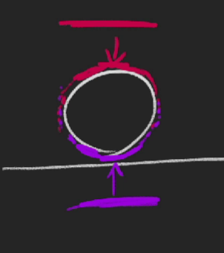

# Study Note

What I studied / learned during [this course](https://threejs-journey.com)

## Chapter 02.

### 14. Lights
Discovered various built-in light classes

AmbientLight:
- It's like omnidirectional. Every part of a object will be lightned up / illuminated the same way.
- To simulate light bouncing!

DirectionalLight:
- Sun-like effect as if the sun were traveling in parallel
- When I want to change its orientation, I can just change its position.
- distance doesn't matter for this light system.

HemisphereLight:
- This one shows similar result to the AmbientLight but can provide two colors, one for the upper side, and one for the bottom side
- omnidirectional!

PointLight:
- It's not like a light bulb. It's like an infinitely small point that lights up the space with specified intensity (+ in every direction).
- the facing part (of object) gets a lot of light and the other parts will have less.
- has additional properties, which are `decay` and `distance`
- decay is how fast the light dims after specified distance units.

RectAreaLight:
- it's like on the photo shoot!
- it onls works with `MeshStandardMaterial` and `MeshPhysicalMaterial`.

SpotLight:
- It's like flash light
- Lights up but faded with distance.
- penumbra specifies how smooth the edges are.
- decay value changes how fast the light intensity goes to zero
- how it can be rotated is different from other lights, I need to change the position of its target and add the target to the scene!

lights impart performance so adding too mushg light is a bad idea(Generally!!!!!!!!)

Minimal cost lights
- `Ambient light`
- `Hemisphere light`

High cost lights
- SpotLight
- RectAreaLight

#### Bake
When I need to put a lot of lights, I can bake them into the texture.
This can be done in a 3D software. But baked light cannot be moved. It's the only drawback.

#### Light helper
It can be a difficult job to position the light when I can't see the effect of the light!

